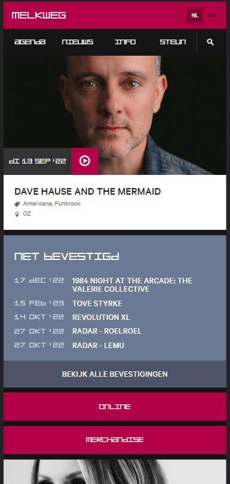
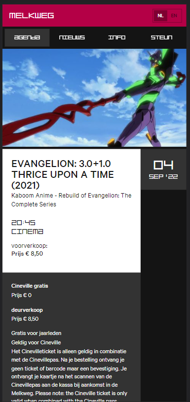
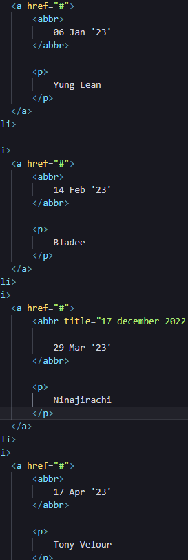

# Procesverslag
Markdown is een simpele manier om HTML te schrijven.  
Markdown cheat cheet: [Hulp bij het schrijven van Markdown](https://github.com/adam-p/markdown-here/wiki/Markdown-Cheatsheet).

Nb. De standaardstructuur en de spartaanse opmaak van de README.md zijn helemaal prima. Het gaat om de inhoud van je procesverslag. Besteedt de tijd voor pracht en praal aan je website.

Nb. Door *open* toe te voegen aan een *details* element kun je deze standaard open zetten. Fijn om dat steeds voor de relevante stuk(ken) te doen.

## Jij

  
uitwerken voor kick-off werkgroep

  ### Auteur:
  Kacper Szymanski  

  #### Je startniveau:
  blauw/rood

  #### Je focus:
  surface plane (bling bling)
 

## Je website

  
uitwerken voor kick-off werkgroep

  ### Je opdracht:
  https://www.melkweg.nl/nl/
  https://www.melkweg.nl/nl/agenda/evangelion-3-0-1-0-thrice-upon-a-time-2021-04-09-2022
  #### Screenshot(s) van de eerste pagina (small screen): 
  Melkweg homepage
  

  #### Screenshot(s) van de tweede pagina (small screen):
  Melkweg concert pagina
  
 

## Toegankelijkheidstest 1/2 (week 1)

  
uitwerken na test in 1e werkgroep

  ### Bevindingen
  Lijst met je bevindingen die in de test naar voren kwamen:

  #### Screenreader
  Screenreader duurde lang en was niet snel door te lopen. 

   -------------------------------- --------------------------------
  Gebruiker eerder menu's aangeven, niet alles onnodig laten oplezen

  #### Muis en Toetsenbord 
  Muis en toetsenbord is redelijk goed te doen. Wel soms lastig zichtbaar wat highlighted is. Sommige navigaties duren lang om doorheen te gaan.
 -------------------------------- --------------------------------

  Zichtbaarheid verbeteren van border-box, miss op een of andere manier navigatie sneller laten doorlopen?? 

  #### Motoriek (shocks, elastiekjes)
  Motoriek was redelijk te doen. Sommige knoppen zijn te klein om te klikken en te makkelijk om te missen maar in het algemeen was het doenbaar. 

 -------------------------------- --------------------------------
Sommige knoppen misschien wat groter?
  #### Visueel (brillen, contrast, kleurenblind, dark/light). 
  Kleurenblindheid was perfect door te lopen. Er is een goeie contrast tussen kleuren en niks werd minder duidelijk tijdens het doorlopen van de website. 
  De brillen waren interessanter. Met de blurry bril was niks te lezen totdat je de pagina op 300% zoom doet. 
  Met de center vision blackout bril moest je lezen met je pheriferal vision wat voor mij bijna onmogelijk is. Je pheriferal vision is heel wazig.

   -------------------------------- --------------------------------
   Blurry bril zorgde ervoor dat de site niet te lezen van maar de zoom in browsers zou genoeg moeten zijn om dat op te lossen. Center vision blackout was bizar lastig, maar misschien is een screenreader oplossing dan bruikbaar hiervoor?

## Voortgang 1 (week 2)

  
uitwerken voor 1e voortgang

  ### Stand van zaken & Verslag van meeting
 Tijdens week 2 begon ik mijn website te coderen. Ik begreep nogsteeds niet hoe nth-of-type werkte en heb ik vervolgens na het voortganggesprek met Laurens uitgelegd gekregen. Tijdens week 2 leerde ik ook hoe ik :root gebruik om variabele die constant terug gaan komen in mijn code te kunnen bewaren (in mijn geval waren dat vooral kleuren maar je kan het ook gebruiken voor bijvoorbeeld pixels, em's en meer). Voor de rest ben ik vooral geholpen met de plaatsen van content in week 2 aangezien ik vooral daarmee problemen had. 

## Voortgang 2 (week 3)

  
uitwerken voor 2e voortgang

  ### Stand van zaken
  Tijdens week 3 had ik de index bijna af. Ik had vooral problemen met de positioning van de footer en het gebruiken van svgs (moet ik de svg oproepen, de path? wat is xml? etc.)

  

  ### Verslag van meeting
   Na deze meeting wist ik hoe ik verder moest gaan met mijn footer. Ik leerde meer over svgs en hoe ik ze moet gebruiken in de code. Ook leerde ik toen wat precies text-transform is en hoe je het kan gebruiken. 

## Toegankelijkheidstest 2/2 (week 4)

  
uitwerken na test in 8e werkgroep

  ### Bevindingen
  Lijst met je bevindingen die in de test naar voren kwamen (geef ook aan wat er verbeterd is):
  Tijdens de toegangelijkheid test merkte ik dat tab-targeting niet goed was op mij website. Het was vaak niet snel duidelijk waar je bent. Dit moet ik gaan verbeteren. 

  #### Screenreader
  De screenreader werkte prima, alleen sommige plaatjes hebben nog geen alt-tekst waardoor het niet goed word voorgelezen. Dat moet veranderen. 

  #### Muis en Toetsenbord 
 Zoals bij bevindingen geschreven de tab-targeting met de toetsenbord was nog niet helemaal goed. Het moet duidelijker worden waar je precies bent.

  #### Motoriek (shocks, elastiekjes)
 De motoriek ging heel goed, zowel met de shocks als elastiekjes kon ik alle content prima aanklikken. De knoppen zijn ver genoeg van elkaar en groot genoeg om aan te klikken. 

  #### Visueel (brillen, contrast, kleurenblind, dark/light). 
  Kleurenblindheidtest ging in een keer goed. De kleuren zijn genoeg verschillend dat er niks onleesbaar of onprettig word. De brillen waren ook te doen behalve de pheriferal vision bril. Daarmee kon ik letterlijk niks lezen. De blurry brill was ook niet te doen maar je kan de browser laten inzoomen tot 250-300% en dan is t prima te lezen zonder dat te content heel raar word gedisplayed.

## Voortgang 3 (week 4)

  
uitwerken voor 3e voortgang

  ### Stand van zaken
 Index was hier zo goed als klaar buiten de nieuwsbrief. Agenda website was ook grotendeels af maar veel problemen met elementen positionen. Javascript was nog niet begonnen maar dat heb ik tussen week 4 en 5 gedaan na de voortganggesprek. 

 
  

  ### Verslag van meeting
  Tijdens de meeting heb ik veel tips gekregen over mijn layout. Ook wist ik niet hoe ik de "Tweet this" en programma tijdens moest positioneren maar tijdens te meeting kreeg ik er hulp mee. Het ging namelijk om grid-templates die ik moest gebruik maar toen niet wist hoe het werkte. Ook kreeg ik uitleg hoe ik iframes in mijn html moet stoppen om bijvoorbeeld youtube video's er in te krijgen 

## Eindgesprek (week 5)

  
uitwerken voor eindgesprek

  ### Je uitkomst - karakteristiek screenshots:
  
    
   De abbr was onnodig gebruik, daarom heb ik die verandert naar normale 
 elementen. 
   DT en DD tag heb ik verkeerd gebruikt, ze moeten andersom. 

  ### Dit ging goed/Heb ik geleerd: 
   code was grotendeels redelijk gedaan
   geen validator problemen

  ### Dit was lastig/Is niet gelukt:
   To change: 
  voeg light/dark mode toe via mediaqueries  -Done
  voeg :hover/:active states toe    -Done
  werk de read.me bij     -Done
  voeg een javascript code toe die Classlist gebruikt     -Done
  fix heading levels    -Done
  dt/dd code fixen -Done
  abbr in verkeerde context -Done

  

## Bronnenlijst

  
continu bijhouden terwijl je werkt

  Nb. Wees specifiek ('css-tricks' als bron is bijv. niet specifiek genoeg).
  https://developer.mozilla.org/en-US/docs/Web/API/Element/classList
  https://www.w3schools.com/jsref/prop_element_classlist.asp
  https://developer.mozilla.org/en-US/docs/Web/CSS/:hover
  https://developer.mozilla.org/en-US/docs/Web/CSS/animation-play-state
  https://developer.mozilla.org/en-US/docs/Web/CSS/Using_CSS_custom_properties
  http://gcctech.org/csc/javascript/javascript_keycodes.htm
  https://www.w3schools.com/css/css3_animations.asp
  https://developer.mozilla.org/en-US/docs/Web/API/HTMLAudioElement/Audio
  https://www.youtube.com/watch?v=VXWvfrmpapI
  https://www.youtube.com/watch?v=VXWvfrmpapI
  https://css-tricks.com/almanac/
  https://css-tricks.com/snippets/css/a-guide-to-flexbox/

